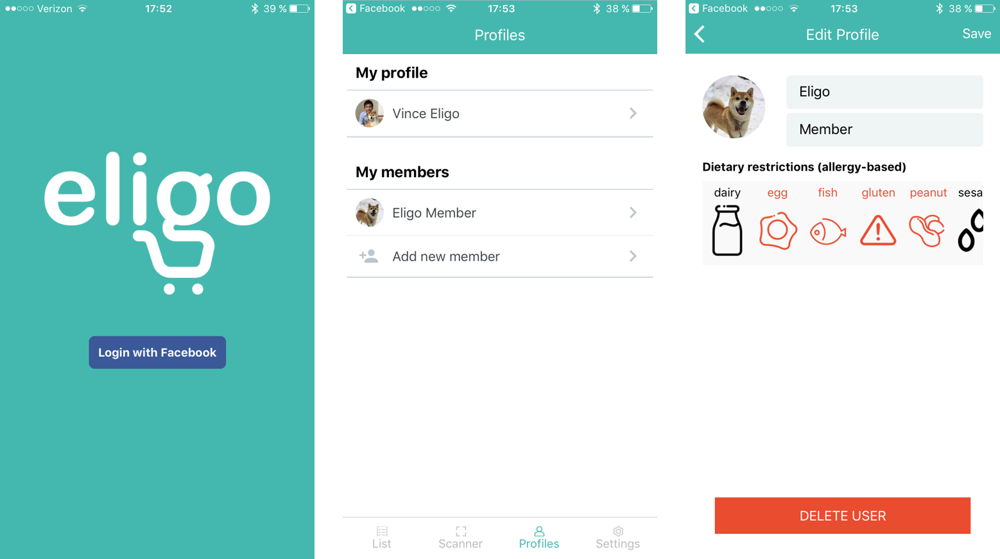
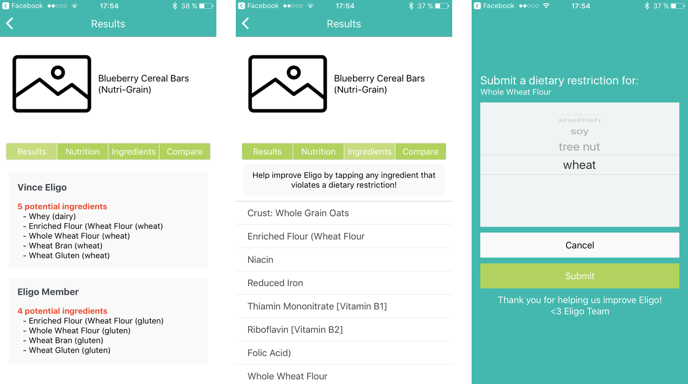

# Eligo
*Don't let dietary restrictions, restrict your shopping*

## Table of contents
- [Team](#team)
- [Setup](#setup)
- [What we do](#what-we-do)
- [App details](#app-details)
- [Main functionality](#main-functionality)
- [Eligo in action](#eligo-in-action)
- [Acknowledgements](#acknowledgements)

## Team
|Personnel|Role|Github name|Email (@uw.edu)
|-|-|-|-|
| Kaitlin L | developer + designer | @kailock | kailock
| Amie H | ux designer | @amieh2 | amieh2
| Alex T | developer | @adtroupe | adtroupe
| Vincent W | developer + pm | @wuv21 | wuv21

## Setup
1. Follow instructions on [React Native's website](https://facebook.github.io/react-native/docs/getting-started.html) to set up React Native.
2. Clone down repo: `git clone https://github.com/capstone-eligo/mobile-eligo.git`
3. `cd` into `Eligo`
4. `npm install`
5. `npm install --save react-native-router-flux@3.38.0`
6. `react-native run-ios`

## What we do
When shopping in grocery stores, nutrition labels can be difficult to read - especially in regards to dietary restrictions. Eligo solves this issue by allowing users to efficiently analyze nutrition labels from consumer food products. Shoppers will be able to scan food products using their Eligo app to get informative alerts about any ingredients that may violate dietary restrictions. These alerts apply to the shopper as well as to any friends/family who consume the food products. As a result, Eligo transforms the shopping paradigm by empowering users with the technology to make quick and safe decisions when purchasing food.

## App details
Eligo's client-side app is built using *React Native* for multiple reasons - some of which include:
  1. Uses JavaScript (ES6) syntax which is familiar to us for development.
  2. Runs natively (uses native UI) on iOS (and Android) which results in faster and more seamless experience, while allowing us to write in JavaScript.
  3. Ability to develop cross-platform apps with as much source code reuse. Currently only being developed for iOS but the setup for Android would be possible with some modifications.
  4. Large community of developers with extensions that use different elements of the iOS architecture.
  5. Supported by Facebook which allows for efficient authentication using Facebook profiles.

Eligo's server-side repo is linked [here](https://github.com/capstone-eligo/server-eligo) and is built with Node JS + Express and deployed on Heroku. Further details can be accessed at the provided repo link.

## Main functionality
Eligo is built with the consumer in mind as they shop in grocery stores for food products - whereupon the food products can be used for family and friends as well. This augmented shopping paradigm means that there is increased difficulty in keeping track of different dietary restrictions across multiple people. Eligo simplifies this process by having a friendly interface to analyze products by their barcodes and present the information for multiple profiles at the same time.

The four major parts of Eligo are detailed below:
  1. **Shopping list** - Helps users keep track of any products that they need to buy. The list is synced across devices.
  2. **Scanner and Results** - Allows users to scan barcodes and get informative alerts based on user-set dietary restrictions. Users can additionally see nutritional information, the complete ingredient list, as well as compare with another product.
  3. **Profiles** - Provides users with the ability to create, update, and delete profiles. Only the main account is authenticated by facebook and any members are added separately by the primary user.
  4. **Settings** - Allows users to view more information about Eligo such as Terms of Service, Privacy Policy, and the ingredients that are currently connected to each dietary restriction.

## Eligo in action
Pictures...

Video...

## Acknowledgements
- [Nutritionix API](https://www.nutritionix.com/business/api) for their wonderful API in connecting UPC to nutritional information

## References
- TBA
